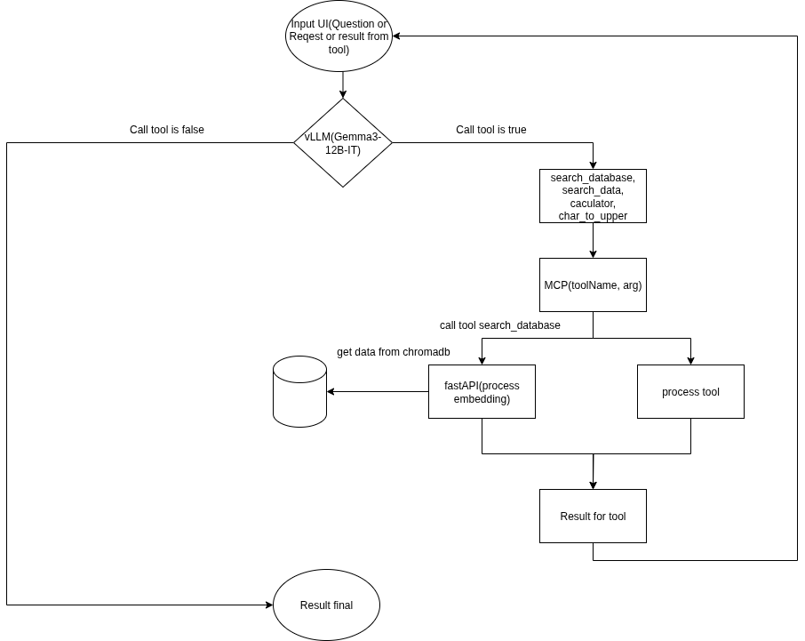

## Hi there 👋
- 🔭 I am currently an artificial intelligence engineer specializing in natural language processing and audio.
- 🌱 I am currently researching frameworks such as PyTorch, TensorFlow, Transformer, and algorithms like LLM, CNN, KNN, YOLO, and diffusion-based voice conversion.
- 👯 I am seeking collaborations to develop chatbot and callbot applications using LLM models such as Gemma and LLaMA, with the goal of building automated customer support systems.
- 💬 If you are interested in discussing academic topics or the projects I am working on, please feel free to contact me — I am always open and willing to connect.

## Personal information
- **My full name**: Nguyen Van Nguyen
- **Gender**: Male
- **Graduated in Computer Science**
- **Graduated in 2024**

## Knowledge
- **Machine Learning / Deep Learning**: PyTorch, TensorFlow, HuggingFace Transformers.
- **Natural language processing(NLP)**: LLM, Tokenization, Named Entity Recognition, Text Generation, Fine-tuning LLMs.
- **Computer Vision**: YOLOv8, CNN, Image Classification & Object Detection.
- **Tools**: Git, Github, Docker.
- **Model LLM**: Gemma, OpenAI GPT, Mistral, LLaMA, BERT, RAG pipeline.
- **Fine-tuning LLMs**: Unsloth AI, LoRA, QLoRA.
- **Language programming**: Python, Java, C/C++.

## Personal Project

### Chatbot RAG
- Development in 2025 at TQT GLOBAL TRADING CO., LTD

| Project Name                 | Main Tech                                                                                                 | Description |
|-----------------------------|-----------------------------------------------------------------------------------------------------------|-------------|
| **Internal Chatbot for Business** | - **Model LLM**: Gemma 3 12B IT  <br> - **Server**: vLLM <br> - **Server MCP**: Process tools <br> - **Server FastAPI**: Process vector DB <br> - **Type**: RAG <br> - **Vector DB**: ChromaDB <br> - **Model Embedding**: sentence-transformers/paraphrase-multilingual-MiniLM-L12-v2 <br> - **Search Engine**: SearXNG <br> - **UI**: Vercel AI Chatbot (Next.js) | An internal chatbot designed for document query tasks using Markdown files to answer questions related to internal documentation. It utilizes the Gemma 3 LLM and is implemented in a RAG (Retrieval-Augmented Generation) architecture, with the main inference server powered by vLLM. |
- [Server vLLM](https://docs.vllm.ai/en/stable/)
- [Server MCP](https://modelcontextprotocol.io/overview)
- [FastAPI](https://fastapi.tiangolo.com/)
- [Gemma3-12B-IT](https://www.kaggle.com/models/google/gemma-3/transformers)
- [Vector DB](https://www.trychroma.com/)
- [Model Embedding](https://huggingface.co/sentence-transformers/paraphrase-multilingual-MiniLM-L12-v2)
- [Search Engine](https://github.com/searxng/searxng)
- [UI](https://github.com/vercel/ai-chatbot)
#### Flow Chatbot RAG.

#### Help Fine tune models LLM (Gemma 3)
- Select the topic for fine-tuning.
- Collect text data related to the topic.
- Dataset format for fine-tuning Gemma3 type jsonl: ```{"instruction": "content", "input": "content", "output": "content"}```
```Note 1: 
Instruction: There is always – for the model to understand what to do, it is a question or a request.
Input: Sometimes there is input data (text, questions, etc.).
Output: Training objective – the model to be generated, usually the answer to a question or request.
```
```Note 2:
You are a data design expert for fine-tuning the Gemma 3 model. You must always generate data in the following structure: {"instruction": "content", "input": "content", "output": "content"}.
Use the data below to create examples that are both creative and user-friendly.
```
- Use Unsloth AI for fine-tuning [Unsloth](https://unsloth.ai/).
#### Cài đặt searchXNG
- Kiểm tra phiên bản docker xem có cài đặt chưa
```docker --version```
- Tải github chứa chương trình searchXNG.
```
git clone https://github.com/searxng/searxng-docker.git
cd searxng-docker
 ```
- Thêm cấu hình vào setting.yml 
```enable_cors: true```
```
search:
  formats:
    - html
    - json
```
- Cách xem file setting.yml
```cat settings.yml```
- File setting.yml full có dạng
```
# see https://docs.searxng.org/admin/settings/settings.html#settings-use-default-settings
use_default_settings: true
server:
  # base_url is defined in the SEARXNG_BASE_URL environment variable, see .env and docker-compose.yml
  secret_key: "VTX0ooIIlCmcGGj59UdIABI5ACOEwy"  # change this!
  limiter: false  # enable this when running the instance for a public usage on the internet
  image_proxy: true
  enable_cors: true
ui:
  static_use_hash: true
redis:
  url: redis://redis:6379/0
search:
  formats:
    - html
    - json
```
- Trong thư mục searxng-docker tạo file .env
```SEARXNG_PORT=8080
SEARXNG_BASE_URL=http://localhost:8080
```
- Chạy docker
```docker-compose up -d```
- Lệnh tắt và bật docker (Phục vụ cho khởi dộng lại docker)
```cd ~/searxng-docker
docker-compose down
docker-compose up -d
```

#### Cài đặt Cloudflared
- Cài đặt Cloudflared.
```wget https://github.com/cloudflare/cloudflared/releases/latest/download/cloudflared-linux-amd64
chmod +x cloudflared-linux-amd64
mv cloudflared-linux-amd64 cloudflared
```
- Di chuyển file vào /usr/local/bin để có thể chạy cloudflared từ bất kỳ đâu 
```sudo mv cloudflared /usr/local/bin/```
- Chạy Tunnel
```cloudflared tunnel --url http://localhost:8000```
* Lưu ý với Cloudflared: Đối với vllm thì sử dụng port 8000 còn đối với searXNG thì sử dụng port 8080.

---

### Diffusion Model Voice Conversion
- Undergraduate Thesis in 2024.

| Project Name                 | Main Tech                                                                                                 | Description |
|-----------------------------|-----------------------------------------------------------------------------------------------------------|-------------|
| **Diffusion Model Voice Conversion** | - **Diffusion voice model** <br> - **Hifi-gan** <br> - **Read-time-voice-clone**                 | This is my graduation thesis on Vietnamese voice conversion, aiming to change the speaker's voice while preserving the original words in the conversation. The system has practical applications such as film dubbing, and child-focused apps that allow children to hear stories in their parents' voices, etc. |
#### Diffusion voice model
- [Paper](docx/2109.13821v2.pdf)
- [Model Base](https://github.com/huawei-noah/Speech-Backbones/tree/main/DiffVC)
- [viMFA - Montreal Forced Aligner](https://github.com/v-nhandt21/ViMFA/tree/main)
- [Montreal Forced Aligner](https://montreal-forced-aligner.readthedocs.io/en/latest/)
#### Hifi-gan
- [Paper](docx/2010.05646v2.pdf)
- [Model Base](https://github.com/jik876/hifi-gan)
#### Read-time-voice-clone
- [Model Base](https://github.com/CorentinJ/Real-Time-Voice-Cloning)
#### Dataset
- [VIVOS](https://www.kaggle.com/datasets/thinh127/vivos-vietnamese)
#### Link project
- [Link project](https://github.com/nnailabs/DiffusionVoiceVietNam)

---

### Diffusion-TTS-Single-Speaker-VietNam
| Project Name                 | Main Tech                                                                                                 | Description |
|-----------------------------|-----------------------------------------------------------------------------------------------------------|-------------|
| **Diffusion-TTS-Single-Speaker-VietNam** | - **Model Diffusion** <br> - **Hifi-gan**                                                    | This is a text-to-speech (TTS) project leveraging a diffusion-based model to generate high-quality audio from text with speed and precision. |
- [Paper](https://grad-tts.github.io/)
- [Model Base](https://github.com/huawei-noah/Speech-Backbones/tree/main/Grad-TTS)
- [viMFA - Montreal Forced Aligner](https://github.com/v-nhandt21/ViMFA/tree/main)
- [Montreal Forced Aligner](https://montreal-forced-aligner.readthedocs.io/en/latest/)
#### Dataset
- [Dataset](https://huggingface.co/datasets/ntt123/infore/resolve/main/infore_16k_denoised.zip)
#### Link project
- [Link project](https://github.com/nnailabs/Diffusion-TTS-Single-Speaker-VietNam)

---
### Waste classification system
- Computer vision group project in 2024.

| Project Name                 | Main Tech                                                                                                 | Description |
|-----------------------------|-----------------------------------------------------------------------------------------------------------|-------------|
| **Waste classification system** | - **CNN** <br> - **Flask**: Server - **UI**: html, css, js                                             | Computer vision project for classifying waste types (plastic, metal, organic, paper) using CNN and YOLO algorithms. |
#### CNN Model
- **LeNet-5**: 
- **AlexNet**:
- **ResNet**:
- **MobileNet**: 
#### YOLOv8
- [Paper](docx/2408.15857v1.pdf)
- [Model Base](https://github.com/autogyro/yolo-V8)
#### Dataset
- 500 images Metal.
- 500 images Plastic.
- 500 images Paper.
- 500 images Organic.
#### Label Studio
- [Label Studio](https://labelstud.io/)
- Label Studio is used for image annotation, where labels involve object bounding (region-based labeling).

---

### EBook-App
- Project ecommerce develop 2024.

| Project Name                 | Main Tech                                                                                                 | Description |
|-----------------------------|-----------------------------------------------------------------------------------------------------------|-------------|
| **EBook-App**               | - **Server Java Jakatar EE 8** <br> - **CSDL**: MySQL <br> - **UI**: Bootstrap 4                          | This is a personal e-commerce project developed with basic e-commerce features. |
#### Java Jakatar EE 8 - JSP, Servlet, JDBC
#### Link Project
- [Link Project](https://github.com/nnailabs/EBook-App)
